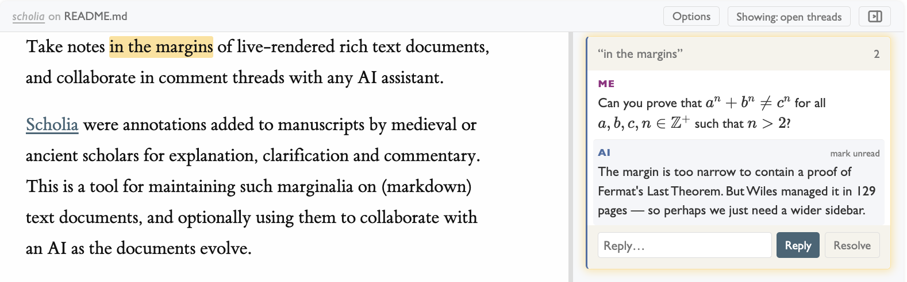

# Scholia

Take notes in the margins of live-rendered rich text documents, and collaborate in comment threads with any AI assistant.

[Scholia](https://en.wikipedia.org/wiki/Scholia) were annotations added to manuscripts by medieval or ancient scholars for explanation, clarification and commentary. This is a tool for maintaining such marginalia on (markdown) text documents, and optionally using them to collaborate with an AI as the documents evolve.



## What is this?

Scholia provides a simple interactive comment-thread interface on top of rendered markdown documents, for notetaking and collaboration. You get:

- A **browser UI** that renders markdown files (with code, LaTeX math, BibTeX citations, etc. via [Pandoc](https://pandoc.org/)) and adds an interactive comment sidebar where you can select text and start threaded converations
  - Resolve and reopen threads, or filter to show only open threads
  - Hide the sidebar entirely for a clean reading view
  - Toggle between footnotes and sidenotes, and dark and light theme
- **Live sync** — edits to the markdown or new comments show up instantly in the browser via WebSocket
- Behind the scenes, a **CLI API** (`scholia list`, `scholia reply`, `scholia comment`, ...) for reading and responding to threads — designed for AI agents, but usable by anyone

**Example:** You're chatting with an AI about a plan. The AI drafts the plan a markdown file `plan.md`. Now you're going through the file and want to ask questions or push back on specific parts. In a linear chat, the conversation quickly loses track of which comment refers to which section, and it's hard to make minor comments while also continuing the general conversation. With scholia, you open the rendered plan in your browser (math, code, citations all formatted), select text in the document and add notes or start threaded converations right there in the margin. Meanwhile the AI can also edit the document directly. Everything stays anchored to the text it's about, and you can keep the terminal chat going for bigger-picture discussion.

## Install

Requires Python 3.10+ and [Pandoc](https://pandoc.org/installing.html).

### Step 1: Install the `scholia` CLI

Using [uv](https://docs.astral.sh/uv/) (or [pipx](https://pipx.pypa.io/)):

```bash
uv tool install git+https://github.com/postylem/scholia.git
# or with pipx:
# pipx install git+https://github.com/postylem/scholia.git
```

After install, the `scholia` command is available globally (you may need to restart your shell). You can use it to live-render and take notes on any markdown file with the command `scholia view`.

Notes:

- Your name in comment threads is detected from your system username. To override it, set the `SCHOLIA_USERNAME` environment variable.

- If you've already installed, and want to update to the latest version:
  ```bash
  uv tool upgrade scholia
  ```

- Alternately, you can clone a local version and install in editable mode so local code changes take effect immediately:

  ```bash
  git clone https://github.com/postylem/scholia.git
  cd scholia
  uv tool install -e .
  ```

### Step 2 (optional): Set up the agent skill

If you want an AI agent to read and reply to your comments, install the agent skill.

```bash
# Installs to ~/.claude/skills/scholia/SKILL.md (Claude global skill)
scholia skill-init
```

Default skill installation location is as a Claude global skill. For local installation, or other agents, specify the path manually, for example:

```bash
scholia skill-init .claude/skills/scholia/SKILL.md       # Claude (project-local)
scholia skill-init .agents/skills/scholia/SKILL.md       # Codex / opencode / Cursor (project-local)
scholia skill-init ~/.codex/skills/scholia/SKILL.md      # Codex (global)
scholia skill-init ~/.cursor/skills/scholia/SKILL.md     # Cursor (global)
```

This copies a single markdown file describing the CLI commands and review workflow. Inspect it at [`data/agent-instructions.md`](data/agent-instructions.md) to see exactly what your agent will be told.

## Files

Scholia doesn't touch your markdown file — it only reads and renders it. When you run `scholia view` on some file `<file>.md`, it creates sidecar files in the same directory:

- `<file>.md.scholia.jsonl` — comment threads (append-only, [W3C Web Annotation](https://www.w3.org/TR/annotation-model/) format)
- `<file>.md.scholia.state.json` — per-thread read/unread state (created when you view threads in the browser)

If you're working in a git repo, you'll probably want to ignore at least the state file:

```gitignore
# Scholia read/unread state (personal, never shared)
*.scholia.state.json
# Uncomment to also ignore annotation threads:
# *.scholia.jsonl
```

## Usage

Start a server and open the URL in your browser:

```bash
scholia view idea.md
```

Select text to start a thread. Edit the markdown in your editor for a live preview. The comment sidebar and document view update in real time.

If you've set up the agent skill, tell your agent to respond when you're ready:

```
> check the scholia for idea.md
```

The agent will go through open comment threads, reply to each, and/or edit the document. Replies appear live in the sidebar.

## For agents

This section is for AI agents reading this README. You rely on the skill installed by `scholia skill-init` for the full workflow, but here's an overview of the CLI API:

```
scholia list <doc.md> --open              List open comment threads
scholia list <doc.md> --open -v           List open threads with message bodies
scholia show <doc.md> <id>               Show a single thread with all messages
scholia reply <doc.md> <id> "text"        Reply to a thread
scholia edit <doc.md> <id> "text"         Edit the last message in a thread
scholia comment <doc.md> "anchor" "text"  Add a new comment anchored to text
scholia resolve <doc.md> <id>             Resolve a thread
scholia unresolve <doc.md> <id>           Reopen a thread
```

Use `scholia list --open -v` to see threads and their messages, reply with `scholia reply`, and edit the `.md` file directly when the comment requests a change to the document.
