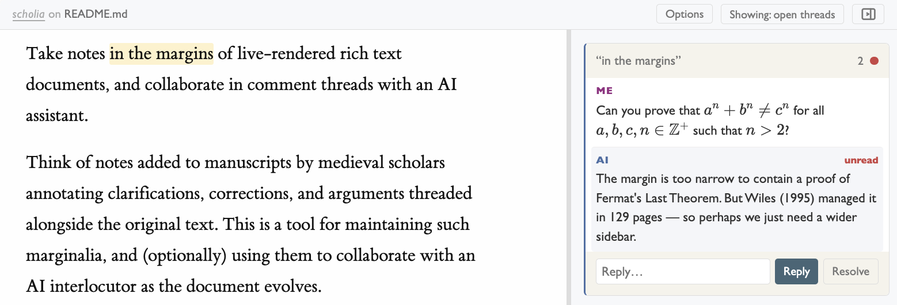

# Scholia

Write rich text in your editor, review the rendered version with an AI assistant via live comments in the margins on your browser.

Think of marginal annotations scribbled in the margins of manuscripts by medieval scholars. Such [*scholia*](https://en.wikipedia.org/wiki/Scholia) could be clarifications, corrections, and arguments threaded alongside the original text. This is for doing that, but with an AI interlocutor.



## How It Works

- You edit some `<doc>.md` file in your editor
- The browser shows a live-rendered view with a comment sidebar
- Comments are stored in `<doc>.md.scholia.jsonl` (append-only, W3C Web Annotation format)
- File changes are detected via watchdog and pushed to the browser via WebSocket
- AI assistant reads and replies to comments via the CLI

## Prerequisites

- Python 3.10+
- [Pandoc](https://pandoc.org/installing.html)

## Install

Install from GitHub directly

```bash
pipx install git+https://github.com/postylem/scholia.git
```

or clone this repo and install from source

```bas
pipx install .
# or
uv tool install .
```

## Usage

For some document `idea.md`:

```bash
# Start the annotation server
scholia start idea.md
```

- Open the rendered version in your browser
- Select text in the document to add comment. Or edit the markdown for a live preview of changed to the main text. 
- When you are ready, tell your agent to take a pass and respond to comments
    ```
    > take a look at the scholia for idea.md
    ```
    It should follow use the API to write replies to comment threads, or modify the main text. Replies and edits will show up live.  
    

## AI Agent Setup

Scholia works with any AI coding agent. Just run `scholia init` to add review instructions globally (recommended), or to your project:

```bash
# Claude Code (default)
scholia init

# Cursor
scholia init .cursor/rules/scholia.md

# Codex
scholia init AGENTS.md

# opencode
scholia init .opencode/skills/scholia.md

# Global install (always available, not per-project)
scholia init --global
```

This writes a single markdown file containing the CLI commands and review workflow your agent needs. The file is self-contained — inspect it to see exactly what your agent will be told. Run `scholia init --force` to update it after upgrading scholia.

## CLI Reference

```
scholia start <doc.md>                    Start annotation server
scholia start <doc.md> --port 888         Start server at specified port [Auto-pick a free port if none set]
scholia list <doc.md> --open              List open comments
scholia list <doc.md> --all               List all comments
scholia reply <doc.md> <id> "text"        Reply to a comment
scholia comment <doc.md> "anchor" "text"  Add a new comment
scholia resolve <doc.md> <id>             Resolve a thread
scholia unresolve <doc.md> <id>           Reopen a thread
scholia init [path]                       Write agent instructions
scholia init --global [path]              Write to home directory
```
